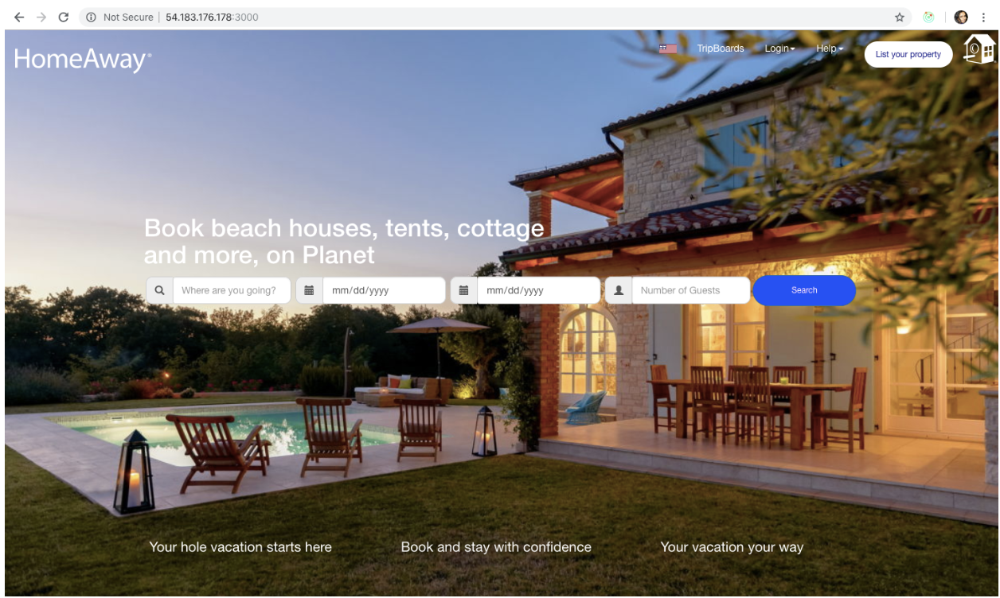
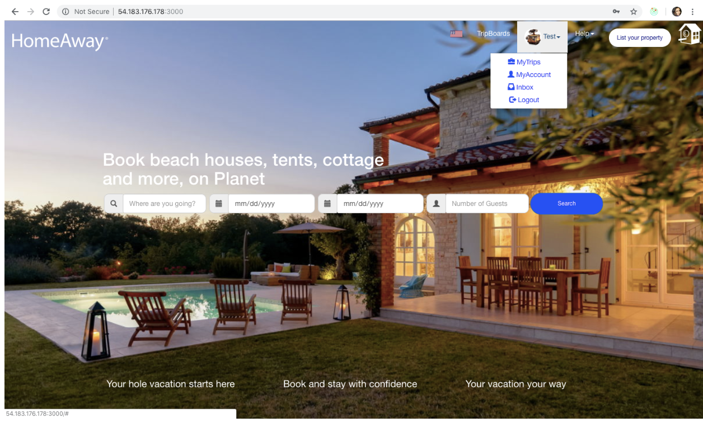

# CMPE273-15

```
git clone https://github.com/Anuragis/CMPE273-15.git
cd CMPE273-15
```

## To Run Calculator 

```
cd Calculator
yarn install
yarn dev
```

---

## HomeAway 

To Run Homeaway
```
cd HomeAway
yarn install
yarn dev
```
---

## Technologies:

### Front-end:
```
- ReactJS
- HTML
- Redux
```

### Back-end:
```
- NodeJS
- Kafka
```

### Database:
```
- MongoDB
```
---

## App Images 

Landing Page



After Login



---

## User Login Details

###### Traveler Login

| Email                     | Password        |
| ------------------------- | --------------- |
| TestTraveler@gmail.com    | TestTraveler    |
| TestTraveler1@gmail.com   | TestTraveler1   |

###### Owner Login

| Email                     | Password           |
| ------------------------- | ------------------ |
| john.bennett@gmail.com    | cornelius          |
| masai.mwinzi@gmail.com    | cornelius1         |
| TestOwner@gmail.com       | TestOwner          |
| TestOwner1@gmail.com      | TestOwner1         |
